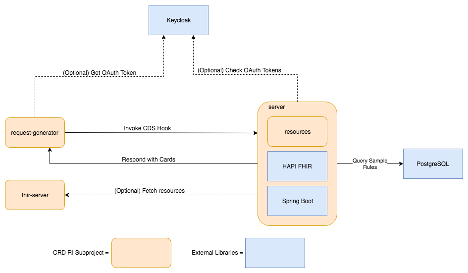

# Coverage Requirements Discovery (CRD) Reference Implementation (RI)

The Coverage Requirements Discovery (CRD) Reference Implementation (RI) is a software project that conforms to the [Implementation Guide](http://build.fhir.org/ig/HL7/davinci-crd/) developed by the [Da Vinci Project](http://www.hl7.org/about/davinci/index.cfm?ref=common) within the [HL7 Standards Organization](http://www.hl7.org/).

The CRD RI project is software that can simulate all of the systems involved in a CRD exchange. The main component in this project is the server, which acts as a healthcare payer information system. This system handles healthcare provider's requests to understand what documentation is necessary prior to ordering Durable Medical Equipment (DME), service or medication. For example, users are able to formulate a request for DME coverage requirements, such as “what are the documentation requirements for Home Oxygen Therapy (HCPCS E0424) for a 65 year old male living in MA?”. This type of question is not asked in plain english through a user interface, but submitted through [CDS Hooks](https://cds-hooks.org/). The CRD RI queries a repository and provides a response, such as a PDF with the documentation requirements back to the requesting system.

This software lets EHR vendors and payer organizations examine how the proposed standard will work and allows them to test their own implementation of the standard.

## Running CRD

You can find a complete end-to-end set up guide for DRLS, including CRD, [here](SetupGuideForMacOS.md).

## Project Structure

Folders within this project make up subprojects. This section provides a brief description of each. More detailed information can be found in the subproject folders.

Subprojects:

* [CRD RI Server](https://github.com/HL7-DaVinci/CRD/tree/master/server) - java application that implements the CDS service in CRD

* examples - JSON examples of requests and responses
* resources - java objects to represent the data structures involved in CRD requests and responses
* testingClient - small java application that makes a CRD request and logs the response

Standalone or supporting apps for this project are contained in other repositories.  These include:

* [crd-request-generator](https://github.com/HL7-DaVinci/crd-request-generator) - React/node.js based web UI that can generate basic CRD requests and display the returned CDS Hooks cards.
* [test-ehr](https://github.com/HL7-DaVinci/test-ehr) - A HAPI FHIR server with additional support for the data needed to be forwarded to the dtr SMART on FHIR application.
* [smart-app](https://github.com/HL7-DaVinci/dtr) - A SMART of FHIR application for Documentation Templates and Rules (DTR).

## System Architecture
The subprojects in this repository are capable of simulating the entire set of interactions required for CRD. Their interactions can be seen in the following diagram:

It is not necessary to run all of the components in this system to work with the RI. Depending on your organization's role, you are likely to use a particular subset of the components.

The RI supports the use of [OAuth 2.0](https://oauth.net/2/) as described in the [FHIR Resource Access](https://cds-hooks.org/specification/1.0/#fhir-resource-access) and [SMART App Authorization Guide](http://docs.smarthealthit.org/authorization/). The management of OAuth tokens is handled by [Keycloak](https://www.keycloak.org/), an open source identity management system. In this system, the `crd-request-generator` uses Keycloak to manage JSON Web Tokens that authorize usage of the CRD app, and the DTR SMART app uses Keycloak to retrieve tokens that can be used to access the `test-ehr`. The `test-ehr` will contact Keycloak to check the validity of the token. The RI can be set up to operate securely and use OAuth tokens to authorize access, or it may be configured in an open fashion for testing.

### Healthcare Provider Components
On the left side of the diagram, we have two components that simulate functionality that is provided by an EHR system. The first is `crd-request-generator`. This is a web application that can generate a simple CRD request via CDS Hook. The web application allows a user to enter basic demographic information as well as a code for the requested service/device/medication. Once the request has been submitted, the application will display any cards that have been returned by the CDS Service.

`test-ehr` provides a basic FHIR server that is intended to satisfy any requests from the CDS Service that have not been populated via prefetch. If the system generating the request completely populates the prefetch, or the CDS Service processing the request is simplistic, this component is not necessary. 

### Healthcare Payer Components
`server` is an implementation of a CDS Service. It handles CDS Hooks requests and returns results. The service performs some basic parsing of the request to extract basic demographic information and the code of the requested item. Based on that information, the service will consult a repository and return information from the repository in CDS Hook cards. The  documentation requirements rules can be found here [CDS-Repository](https://github.com/HL7-DaVinci/CDS-Library).

## Prerequisites
* Java - JDK 8 - [Oracle JDK Downloads](http://www.oracle.com/technetwork/java/javase/downloads/jdk8-downloads-2133151.html)
* Gradle 6.3 - [Gradle Installation Instructions](https://gradle.org/install/)
* (optional) Keycloak - [Keycloak](https://www.keycloak.org/downloads.html)
* (crd-request-generator only) - [node.js](https://nodejs.org/en/download/), [React](https://reactjs.org/)

## Building, testing and running
1. Clone the repo
  * `git clone https://github.com/HL7-DaVinci/CRD.git`
1. Test the code (optional)
  * `gradle clean check`
1. Build the code
  * `gradle build`

Visit the [server README](server/README.md) to see how to run the server or the [crd-request-generator README](https://github.com/HL7-DaVinci/crd-request-generator/) for information on running these subprojects.

## Setting up a KeyCloak instance

If you want to test CRD in a secure fashion using OAuth, you will need to install and configure Keycloak. The following instructions are for configuring Keycloak for all subprojects in the RI:

1. Download and unzip KeyCloak Server from [here](https://www.keycloak.org/downloads.html)
2. From command line navigate to the directory KeyCloak was downloaded to and then type `unzip keycloak-<Version>.zip` followed by `cd keycloak-<Version>/bin`
3. Run `./standalone.sh -Djboss.socket.binding.port-offset=100` from command line to start the server.  It should run on port 8180
4. Navigate to the KeyCloak instance in a browser, it should be at [http://localhost:8180/](http://localhost:8180)
5. When prompted, create a new administrative username and password in Administration Console.
6. Login to the Administration Console with administrative username and password created in previuos step.
7. Click Add Realm (hover over the word 'Master' in the sidebar) to find the button. The realm will be protecting the `test-ehr`.
	* Import the realm by selecting the `import` option on the realm creation screen (see "Add a new realm:" below). Importing `[test-ehr repo]/src/main/resources/ClientFhirServerRealm.json` will set up the clients, but you will still have to make a new user and modify the config files.

			Add a new realm:
			1) click Master (top left nav bar)
			2) click add realm
			3) Import | Select file to import (e.g. file from above) 

8. If building the realm manually, make two clients by navigating to the `Clients` tab
	* The name given to the clients will be their `client ID`
	* Make one client 'public' named `app-login` and one client 'bearer-only' named `app-token` with the `Access-type` dropdown.
	* In the public client, find the `Web Origins` input and add the address of the EHR FHIR server. Alternatively just put `*` in `Web Origins` if running everything locally, this is less secure and should not be done in a production setting.
	* In the public client, add a redirect URL. It can generally work fine as the base URL of the server such as [http://localhost:8080](http://localhost:8080)
9. If building the realm manually, navigate to the `Roles` tab and make a new role called `user`. This role will already exist if the realm was imported.
10. Navigate to the `Users` tab and make a new user.
	* Give the new user a password in the `credentials` tab. Make sure to turn the 'Temporary' slider off before clicking 'Reset Password'.
	* Go to `Role Mappings` and add the `user` role
11. Modify config files to point at your new clients and realms
	* Change `[test-ehr repo]/src/main/resources/fhirServer.properties` to use the client ID (`app-token` if using imported realm), realm name, and client secret of the bearer only client, then set `use_oauth` to `true` in order to use the security feature.
		* The bearer only client's secret can be found in the `Credentials` tab
	* Change `[cdr-request-generator repo]/src/properties.json` to include the name of the realm and the client ID of the public client
	
NOTE: As of right now, the security feature will protect the EHR server in its entirety. There is no way to choose which endpoints to protect and to what degree. The security feature will hopefully be able to identify different types of users (e.g `admin` vs `user`) in the future.   

## Preferred Development Environment
The core CRD team develops with [IntelliJ IDEA](https://www.jetbrains.com/idea/) and/or Visual Code. There are no requirements to use Java IDE for working on the project and any other Java IDE should work fine.

### IntelliJ IDEA Setup
1. Create new project from existing sources
2. Choose the CRD folder
3. Specify that it is a gradle project

### Running the server from the IntelliJ IDEA UI
1. Select the gradle tool window
1. Choose CRD --> :server --> Tasks --> application --> bootRun

## Questions and Contributions
Questions about the project can be asked in the [Da Vinci CRD stream on the FHIR Zulip Chat](https://chat.fhir.org/#narrow/stream/180803-Da-Vinci.20CRD).

This project welcomes Pull Requests. Any issues identified with the RI should be submitted via the [GitHub issue tracker](https://github.com/HL7-DaVinci/CRD/issues).

