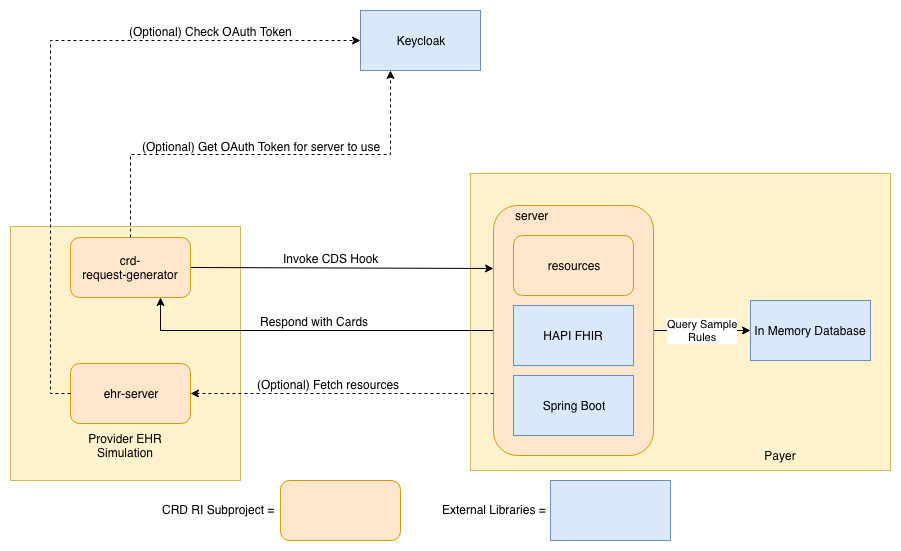

# Coverage Requirements Discovery (CRD) Reference Implementation (RI)

The Coverage Requirements Discovery (CRD) Reference Implementation (RI) is a software project that conforms to the [Implementation Guide](http://build.fhir.org/ig/HL7/davinci-crd/) developed by the [Da Vinci Project](http://www.hl7.org/about/davinci/index.cfm?ref=common) within the [HL7 Standards Organization](http://www.hl7.org/).
 
The CRD RI project is software that can simulate all of the systems involved in a CRD exchange. The main component in this project is the server, which acts as a healthcare payer information system. This system handles healthcare providers requests to understand what documentation is necessary prior to prescribing a particular treatment. Users are able to formulate a request for durable medical equipment coverage requirements, such as “what are the documentation requirements for prescribing home oxygen therapy (HCPCS E0424) to a 65 year old male living in MA?”. This type of question is not asked in plain English through a user interface, but submitted through [CDS Hooks](https://cds-hooks.org/). The CRD RI consults a small, example database and provides a response, such as a PDF with the requirements back to the requesting system.
 
This software lets EHR vendors and payer organizations examine how the proposed standard will work and test their own implementations of the standard.

## Project Structure
This is a Java based project that requires at least Java 8 (untested with later versions) and is built with [Gradle](https://gradle.org/) 4.9.

Folders within this project make up subprojects. This section provides a brief description of each. More detailed information can be found in the subproject folders.

Subprojects:
* creator - small java application that writes out a CDS Hook request for `order-review` to a JSON file
* definition - (now obsolete) FHIR OperationDefinition for CRD - this is since been replaced by a CDS Hooks approach
* examples - JSON examples of service requests and responses
* fhir-server - small FHIR server that acts as a representation of the FHIR server that an EHR would host
* operations - (now obsolete) Implementation of the CRD FHIR Operation using [HAPI FHIR](http://hapifhir.io/) - this is since been replaced by a CDS Hooks approach
* request-generator - [react](https://reactjs.org/) based web UI that can generate basic CRD requests and display the returned CDS Hooks cards
* resources - java objects to represent the data structures involved in CRD requests and responses
* server - java application that implements the CDS service in CRD
* testingClient - small java application that makes a CRD request and logs the response

## System Architecture
The subprojects in this repository are capable of simulating the entire set of interactions required for CRD. Their interactions can be seen in the following diagram:

It is not necessary to run all of the components in this system to work with the RI. Depending on your organization's role, you are likely to use a particular subset of the components.

The RI supports the use of [OAuth 2.0](https://oauth.net/2/) as described in the [FHIR Resource Access](https://cds-hooks.org/specification/1.0/#fhir-resource-access) and [SMART App Authorization Guide](http://docs.smarthealthit.org/authorization/). The management of OAuth tokens is handled by [Keycloak](https://www.keycloak.org/), an open source identity management system. The RI can be set up to operate securely and use OAuth tokens to authorize access, or it may be configured in an open fashion for testing.

### Healthcare Provider Components
On the left side of the diagram, we have two components that simulate functionality that is provided by an EHR system. The first is `request-generator`. This is a web application that can generate a simple CRD request via CDS Hook. The web application allows a user to enter basic demographic information as well as a code for the requested service/device. Once the request has been submitted, the application will display any cards that have been returned by the CDS Service.

`fhir-server` provides a basic FHIR server that is intended to satisfy any requests from the CDS Service that have not been populated via prefetch. If the system generating the request completely populates the prefetch, or the CDS Service processing the request is simplistic, this component is not necessary.

### Healthcare Payer Components
`server` is an implementation of a CDS Service. It handles CDS Hooks requests and returns results. The service performs some basic parsing of the request to extract basic demographic information and the code of the requested item. Based on that information, the service will consult a simple database and then return information from the database in CDS Hook cards. The simplistic documentation requirements rules can be modified via an administrative web interface.

## Building and running the server subproject from the command line
1. Clone the repo
	* `git clone https://github.com/HL7-DaVinci/CRD.git`
1. Install dependencies (gradle, postgresql)
1. Build the code
	* `gradle build`
1. Running from the command line
	* Run the fhir server
		* `gradle :server:bootRun`
	* Run the testing client
		* `gradle :testingClient:run`
	* Run the creator tool
		* `gradle :creator:run -PappArgs="['/tmp/']"`

## Seting up the server DB
1. Install and run postgresql
1. Run the gradle task, it will create a database named 'dme' and populate it with a rules table, and the sample rules will be loaded from the csv file.
  * `gradle setupDb` 

This task can also be run to reset the data in the table to match the csv.

## Setting up a KeyCloak instance
1. Download and unzip KeyCloak Server from [here](https://www.keycloak.org/downloads.html)
2. From command line navigate to the directory KeyCloak was downloaded to and then type `unzip keycloak-<Version>.Final.zip` followed by `cd keycloak-<Version>.Final/bin`
3. Run `./standalone.sh -Djboss.socket.binding.port-offset=100` from command line to start the server.  It should run on port 8180
4. Navigate to the KeyCloak instance in a browser, it should be at [http://localhost:8180/](http://localhost:8180)
5. When prompted, create a new administrative username and password.
6. Create two realms, one for the client fhir server, and one for the CRD implementation, choose any name.  Both realms follow the same following steps, the only difference should be the names of the clients
7. Make two clients by navigating to the `Clients` tab
	* Make one client public and the other bearer-only with the `Access-type` dropdown.
	* Find the `Web Origins` input and add the address of the client fhir server and the CRD server.  Alternatively just 	       put `*` in `Web Origins` if running everything locally.
	* Add a redirect URL, can generally work fine as the base url of the server such as [http://localhost:8080](http://localhost:8080)
8. Navigate to the `Roles` tab and make a new role called `user`
	* Navigate to the `Users` tab and make a new user.  
	* Give the new user a password in the `credentials` tab
	* Go to `Role Mappings` and add the `user` role
9. Modify config files to point at the your new clients and realms
	* Change `server/resources/application.yml` keycloak settings to point at the bearer only client in one of the realms
	* Change `fhir-server/resources/fhirServer.properties` to have the client ID and secret of the bearer only client in the second realm
	* Change `request-generator/src/properties.json` to include the second realm and public client ID

## Developing
### Setup

1. Install IntelliJ Idea
2. Create new project from existing sources
3. Choose the CRD folder
4. Specify that it is a gradle project

### Running from the UI

* Select the gradle tool window
* Choose CRD --> :server --> Tasks --> application --> bootRun
* Run org.hl7.davinci.testClient.TestClient.main()
